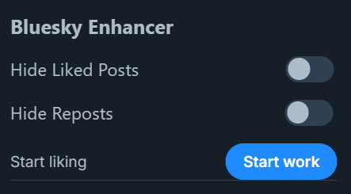

# Bluesky Enhancer

## English Description
This script adds useful features to the Bluesky social media platform. It enhances your browsing experience and allows you to perform various actions quickly.

The script bar looks like this:

[Changelog](CHANGELOG.md)

Write problems found while working with the script to [Issues](https://github.com/MAX1MDEV/BlueskyEnhancer/issues).

**Disclaimer: The usage of this script may violate the Terms of Service of Bluesky. Use at your own risk.**

### Supported Site
| Site               | Features
| :----------------- | :-----------------
| [bsky.app](https://bsky.app/) | Auto-like posts, copy post links, quote messages in chats, hide reposts, hide liked posts, scroll to top (hotkey), quick navigation to Messages (hotkey)

### Features
- Auto-like posts
- Copy post links
- Quote messages in chats
- Hide reposts
- Hide liked posts
- Scroll to top (hotkey)
- Quick navigation to Messages (hotkey)

The script adds a control panel to the Bluesky interface, allowing you to toggle various features and start/stop auto-liking.

### Usage
- The Bluesky Enhancer menu will appear in the sidebar.
- Use toggles to enable/disable hiding reposts and liked posts.
- Click the "Start work" button to begin auto-liking posts.
- Use Ctrl + Up Arrow to quickly navigate to the Home feed.
- Use Ctrl + Down Arrow to quickly navigate to Messages.

### Installation
1. Install one of the browser extensions to run user scripts.  
   Tampermonkey: [Chrome](https://chrome.google.com/webstore/detail/tampermonkey/dhdgffkkebhmkfjojejmpbldmpobfkfo), [Firefox](https://addons.mozilla.org/en-US/firefox/addon/tampermonkey/), [Opera](https://addons.opera.com/en/extensions/details/tampermonkey-beta/), [Edge](https://microsoftedge.microsoft.com/addons/detail/tampermonkey/iikmkjmpaadaobahmlepeloendndfphd)  
   Violentmonkey: [Chrome](https://chrome.google.com/webstore/detail/violentmonkey/jinjaccalgkegednnccohejagnlnfdag), [Firefox](https://addons.mozilla.org/en-US/firefox/addon/violentmonkey/), [Maxthon](https://extension.maxthon.com/detail/index.php?view_id=1680), [Edge](https://microsoftedge.microsoft.com/addons/detail/violentmonkey/eeagobfjdenkkddmbclomhiblgggliao)  
2. Go [here](/../../raw/main/BlueskyEnhancer.user.js).
3. Confirm installation of the script.

Automatic updating of the script may require your confirmation.

### Extension
1. Download zip Release in [Releases](https://github.com/MAX1MDEV/BlueskyEnhancer/releases).
2. Enable developer mode in browser extensions.
3. Install the zip package by moving it to the browser window.

***

## Русское Описание
Данный скрипт добавляет полезные функции на платформу социальных сетей Bluesky. Он улучшает ваш опыт просмотра и позволяет быстро выполнять различные действия.

Панель скрипта выглядит так:

[Список изменений](CHANGELOG.md)

Проблемы, найденные при работе со скриптом, пишите в [Issues](https://github.com/MAX1MDEV/BlueskyEnhancer/issues).

**Отказ от ответственности: Использование данного скрипта может нарушать правила Bluesky. Используйте на свой страх и риск.**

### Поддерживаемые сайты
| Сайт               | Функции
| :----------------- | :-----------------
| [bsky.app](https://bsky.app/) | Автоматический лайк постов, копирование ссылок на посты, цитирование сообщений в чатах, скрытие репостов, скрытие понравившихся постов, прокрутка вверх (горячая клавиша), быстрый переход к сообщениям (горячая клавиша)

### Функции
- Автоматический лайк постов
- Копирование ссылок на посты
- Цитирование сообщений в чатах
- Скрытие репостов
- Скрытие понравившихся постов
- Прокрутка вверх (горячая клавиша)
- Быстрый переход к сообщениям (горячая клавиша)

Скрипт добавляет панель управления в интерфейс Bluesky, позволяя включать и выключать различные функции и запускать/останавливать автоматическое лайканье.

### Использование
- Меню Bluesky Enhancer появится в боковой панели.
- Используйте переключатели для включения/выключения скрытия репостов и понравившихся постов.
- Нажмите кнопку "Start work", чтобы начать автоматически лайкать посты.
- Используйте Ctrl + Стрелка вверх для быстрого перехода на главную ленту.
- Используйте Ctrl + Стрелка вниз для быстрого перехода к сообщениям.

### Установка
1. Установить одно из браузерных расширений для выполнения пользовательских скриптов.  
   Tampermonkey: [Chrome](https://chrome.google.com/webstore/detail/tampermonkey/dhdgffkkebhmkfjojejmpbldmpobfkfo?hl=ru), [Firefox](https://addons.mozilla.org/ru/firefox/addon/tampermonkey/), [Opera](https://addons.opera.com/ru/extensions/details/tampermonkey-beta/), [Edge](https://microsoftedge.microsoft.com/addons/detail/tampermonkey/iikmkjmpaadaobahmlepeloendndfphd?hl=ru-RU)  
   Violentmonkey: [Chrome](https://chrome.google.com/webstore/detail/violentmonkey/jinjaccalgkegednnccohejagnlnfdag?hl=ru), [Firefox](https://addons.mozilla.org/ru/firefox/addon/violentmonkey/), [Maxthon](https://extension.maxthon.com/detail/index.php?view_id=1680), [Edge](https://microsoftedge.microsoft.com/addons/detail/violentmonkey/eeagobfjdenkkddmbclomhiblgggliao?hl=ru-RU)   
2. Перейти [сюда](/../../raw/main/BlueskyEnhancer.user.js).
3. Подтвердить установку скрипта.

При автоматическом обновлении скрипта может потребоваться ваше подтверждение.

### Расширение
1. Скачайте последний zip релиз в [Releases](https://github.com/MAX1MDEV/BlueskyEnhancer/releases).
2. Включите режим разработчика в расширениях браузера.
3. Установите zip-пакет, переместив его в окно браузера.
